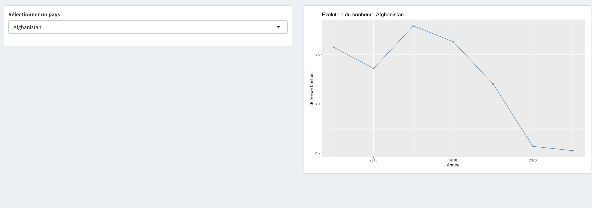

```{r setup, include=FALSE}
knitr::opts_chunk$set(echo = FALSE, message = FALSE, warning = FALSE)
```

# Introduction

Ce projet est réalisé dans le cadre de la matière **Visualisation de données** enseignée à l'Université de Technologie de Troyes.

Notre analyse porte sur le **World Happiness Report**, une enquête annuelle qui récolte des données du monde entier pour indiquer **comment les gens évaluent leur propre vie** dans plus de 150 pays du globe. Le but de notre projet est de concevoir les meilleures visualisations possibles pour analyser les données du World Happiness Report et pour mettre en valeur les informations qui en découlent.


### Lien des datasets

-   [World Happiness Report](https://www.kaggle.com/datasets/unsdsn/world-happiness?select=2017.csv) (de 2015 à 2019)
-   [World Happiness Report](https://www.kaggle.com/datasets/londeen/world-happiness-report-2020) (2020)
-   [World Happiness Report](https://www.kaggle.com/datasets/ajaypalsinghlo/world-happiness-report-2021?select=world-happiness-report-2021.csv) (2021)
-   [Healthy Lifestyle Cities Report 2021](https://www.kaggle.com/datasets/prasertk/healthy-lifestyle-cities-report-2021)

> Le dernier dataset apporte des **indicateurs supplémentaires** sur ce qui est susceptible de provoquer le bonheur des populations (prix de la vie, soleil, obésité...). Cependant, il ne comporte uniquement les données de 2021, ainsi nous pourrons seulement le comparer avec le dataset qui comporte les données du World Happiness Report de 2021. Cela nous permettra d'apporter une nouvelle dimension à notre analyse.

### Données

Le jeu de données que nous avons choisi d'étudier est issu d'une **enquête de référence sur l'état du bonheur dans le monde**. Il comporte des données **de 2015 à 2021**, et classe **155 pays** selon leur niveau de bonheur. Pour établir ce classement, l’ONU demande à un **échantillon d’environ 1 000 personnes** de “répondre à une série de questions sur la perception de leur qualité de vie sur une échelle de 1 à 10” (*échelle de Cantril*). Il permet d'établir une corrélation entre différents critères (liberté, corruption, cadre de vie...) et le niveau de bonheur qui en découle.

Les jeux de données initiaux comportent 13 variables :

| Variable                       | Class     | Description                                                                                                                                                                                |
|:-------------|:-------------|:-------------------------------------------|
| country                        | character | Nom du pays                                                                                                                                                                                |
| region                         | character | Région à laquelle le pays appartient                                                                                                                                                       |
| hapiness rank                  | integer   | Classement du pays sur la base du score du bonheur                                                                                                                                         |
| hapiness score                 | double    | Un indicateur mesuré chaque année en posant aux personnes de l'échantillon la question suivante : "Comment évaluez-vous votre bonheur sur une échelle de 0 à 10 où 10 est le plus heureux" |
| lower confidence interval      | double    | Intervalle de confiance inférieur du score de bonheur                                                                                                                                      |
| upper confidence interval      | double    | Intervalle de confiance supérieur du score de bonheur                                                                                                                                      |
| economy (GPD per capita)       | double    | La mesure dans laquelle le PIB contribue au calcul du score du bonheur                                                                                                                     |
| family                         | double    | La mesure dans laquelle la famille contribue au calcul du score du bonheur                                                                                                                 |
| health (life expectancy)       | double    | La mesure dans laquelle l'espérance de vie a contribué au calcul du score du bonheur                                                                                                       |
| freedom                        | double    | La mesure dans laquelle la liberté a contribué au calcul du score du bonheur                                                                                                               |
| trust (governement corruption) | double    | La mesure dans laquelle la perception de la corruption contribue au score de bonheur                                                                                                       |
| generosity                     | double    | La mesure dans laquelle la générosité a contribué au calcul du score de bonheur                                                                                                            |
| dystopia residual              | double    | "Résidu" correspondant à l'écart entre le modèle théorique et la réalité, auquel on ajoute un score de dystopie (score d'un pays hypothétique moins bien classé que tous les autre)        |

Par la suite, nous avons ajouté plusieurs données nécessaires à la création de cartes : les **coordonnées géographiques des pays**, ainsi que leur **géométrie**, afin de pouvoir colorier les surfaces des pays sur les cartes. Nous avons également ajouté une colonne indiquant le **continent** sur lequel se trouve chaque pays.

> L'ensemble des données utilisées est disponible dans le dossier `/data/`

Ces données nous semblent pertinentes dans le cadre d'une analyse car :

-   Elles sont analysables dans le **temps**
-   Elles sont analysables **géographiquement**
-   Elles permettent d'étudier **différents facteurs de contribution au bonheur** en fonction des régions du monde, des cultures...

### Plan d'analyse

1.  **Classements** : Quels sont les pays et régions du monde les mieux classés en matière de bonheur global ?

2.  **Analyse temporelle** : Comment évolue le bonheur moyen au fil des années ? (en regroupant par région, en utilisant des facet charts pour visualiser les différentes années en même temps)

3.  **Analyse géographique** : Y'a-t-il des régions du monde moins heureuses que d'autres ? Pourquoi ? ➡️ Utiliser les facteurs de contribution du score pour mettre en évidence des causes de disparité

4.  **Analyse factorielle** : Le niveau de bonheur est-il directement corrélé à la liberté des individus ? ➡️ Question extensible à la richesse, à l'espérance de vie...

5.  Quelle combinaison de facteurs hauts entraîne une hausse du bonheur ? Quelle combinaison de facteurs bas entraîne une diminution de celui-ci ? (par exemple: avoir une espérance de vie élevée ET un PIB élevé ET un taux de liberté elevé implique-t-il nécessairement un haut niveau de bonheur, au-dessus d'un certain seuil ?)

# Nettoyage des données

Le **nettoyage des jeux de données** est la première étape du projet, et certainement l'une des plus importantes. Nous nous en sommes rendus compte après avoir essayé de concevoir des graphiques avec les jeux de données bruts : nous avons été très vite restreints, d'un côté car il était impossible d'analyser les données temporellement car les données étaient séparées dans des datasets différents, et de l'autre parce que les noms des variables comportaient des espaces et différaient d'un dataset à l'autre.

Afin de pouvoir travailler efficacement, nous avons opéré le nettoyage suivant :

1.  Nous avons commencé par **analyser tous les datasets** pour voir si les données nommées de la même manière correspondent à la même chose (ce qui n'était pas toujours le cas). Parfois, la variable "freedom" d'un dataset correspondait à la variable "explained_by_freedom" d'un autre dataset.

2.  Nous avons ensuite **renommé toutes les colonnes de tous les datasets** de la même manière selon la **convention** définie ci-dessous.

3.  Nous avons **fusionné l'ensemble des datasets** de manière à travailler sur un seul tableau propre à l'aide de filtres par la suite. Nous avions au préalable **ajouté une variable *Year*** car cette donnée n'était pas fournie à l'intérieur des datasets et nous aurions mélangé toutes les données lors de la fusion des datasets.

4.  Afin de pouvoir travailler avec des cartes, nous avons été contraints d'ajouter pour chaque pays des **données géométriques et GPS**.

#### Convention de nommage des colonnes

-   Le nom des colonnes commence par une **M**ajuscule
-   Les espaces sont remplacés par un underscore "\_"

```{r cleaning}
library(readr)
library(dplyr)
library(tidyr)
library(ggplot2)
library(leaflet)
library(sf)
library(rmapshaper)
library(prettydoc)
library(plotly)
library(scales)
library(data.table)
library(knitr)
library(RColorBrewer)
library(gapminder)

# Import des datasets

data2015 <- tibble(read_csv('data/2015.csv'))
data2016 <- tibble(read_csv('data/2016.csv'))
data2017 <- tibble(read_csv('data/2017.csv'))
data2018 <- tibble(read_csv('data/2018.csv'))
data2019 <- tibble(read_csv('data/2019.csv'))
data2020 <- tibble(read_csv('data/2020.csv'))
data2021 <- tibble(read_csv('data/2021.csv'))
complement2021 <- tibble (read_csv('data/complement_2021.csv'))
countries <- tibble(read_csv('data/countries.csv'))
world_map <- read_sf('data/world_map')
continents <- read_csv('data/continents.csv')

# Nettoyage du dataset "countries" pour pouvoir ajouter les coordonnées géographiques des pays

countries_corrected <- countries %>%
  rename(Country_code =`country`, 
         Latitude = `latitude`,
         Longitude = `longitude`,
         Country = `name`)

# Nettoyage du dataset "world_map" pour pouvoir manipuler les régions du monde sur une carte

world_map_corrected <- world_map %>%
  rename(Country =`NAME`, 
         Geometry = `geometry`)

# Renommage des colonnes (selon la convention définie précedemment) & ajout de la colonne "year" 

data2015_corrected <- data2015 %>% 
  mutate(lower_confidence_interval = `Happiness Score` - `Standard Error`, upper_confidence_interval = `Happiness Score` + `Standard Error`, Year = 2015) %>%
  rename(Happiness_rank =`Happiness Rank`, 
         Happiness_score = `Happiness Score`,
         Standard_error = `Standard Error`,
         Exp_by_economy_gdp_per_capita = `Economy (GDP per Capita)`,
         Explained_by_social_support = Family,
         Explained_by_life_expectancy = `Health (Life Expectancy)`,
         Explained_by_freedom = Freedom,
         Explained_by_trust_government = `Trust (Government Corruption)`,
         Explained_by_generosity = Generosity,
         Dystopia_residual = `Dystopia Residual`)
data2015_corrected$Exp_by_economy_gdp_per_capita <- as.double(data2015_corrected$Exp_by_economy_gdp_per_capita)

data2016_corrected <- data2016 %>% 
  mutate(Standard.Error = `Happiness Score` - `Lower Confidence Interval`, Year = 2016) %>%
  rename(Happiness_rank = `Happiness Rank`, 
         Happiness_score = `Happiness Score`,
         Standard_error = Standard.Error,
         Exp_by_economy_gdp_per_capita = `Economy (GDP per Capita)`,
         Explained_by_social_support = Family,
         Explained_by_life_expectancy = `Health (Life Expectancy)`,
         Explained_by_freedom = Freedom,
         Explained_by_trust_government = `Trust (Government Corruption)`,
         Explained_by_generosity = Generosity,
         Dystopia_residual = `Dystopia Residual`,
         Lower_confidence_interval = `Lower Confidence Interval`,
         Upper_confidence_interval = `Upper Confidence Interval`)
data2016_corrected$Exp_by_economy_gdp_per_capita <- as.double(data2016_corrected$Exp_by_economy_gdp_per_capita)

data2017_corrected <- data2017 %>% 
  mutate(Standard_error = Happiness.Score - Whisker.low, Year = 2017) %>%
  rename(Happiness_rank = Happiness.Rank, 
         Happiness_score = Happiness.Score,
         Exp_by_economy_gdp_per_capita = Economy..GDP.per.Capita.,
         Explained_by_social_support = Family,
         Explained_by_life_expectancy = Health..Life.Expectancy.,
         Explained_by_freedom = Freedom,
         Explained_by_trust_government = Trust..Government.Corruption.,
         Explained_by_generosity = Generosity,
         Dystopia_residual = Dystopia.Residual,
         Lower_confidence_interval = Whisker.low,
         Upper_confidence_interval = Whisker.high)

# on n'a pas l'information de l'erreur standard pour 2018
data2018_corrected <- data2018 %>%
  mutate(Year = 2018) %>%
  rename(Country = `Country or region`, 
         Happiness_score = Score, 
         Happiness_rank = `Overall rank`,
         Exp_by_economy_gdp_per_capita = `GDP per capita`,
         Explained_by_freedom = `Freedom to make life choices`, 
         Explained_by_trust_government = `Perceptions of corruption`, 
         Explained_by_social_support = `Social support`,
         Explained_by_life_expectancy = `Healthy life expectancy`,
         Explained_by_generosity = Generosity) %>% 
  mutate(Explained_by_trust_government = as.double(Explained_by_trust_government))

data2019_corrected <- data2019 %>%
  mutate(Year = 2019) %>%
  rename(Country =`Country or region`, 
         Happiness_score = Score, 
         Happiness_rank = `Overall rank`,
         Exp_by_economy_gdp_per_capita = `GDP per capita`,
         Explained_by_freedom = `Freedom to make life choices`, 
         Explained_by_trust_government = `Perceptions of corruption`, 
         Explained_by_social_support = `Social support`,
         Explained_by_life_expectancy = `Healthy life expectancy`,
         Explained_by_generosity = Generosity) 

data2020_corrected <- data2020 %>%
  mutate(Year = 2020) %>%
  rename(Happiness_score = `Ladder score`, 
         Country = `Country name`, 
         Regional_indicator = `Regional indicator`,
         Standard_error = `Standard error of ladder score`,
         Lower_confidence_interval = lowerwhisker, 
         Upper_confidence_interval = upperwhisker, 
         Logged_gpd_per_capita = `Logged GDP per capita`,
         Social_support = `Social support`,
         Life_expectancy = `Healthy life expectancy`,
         Freedom = `Freedom to make life choices`,
         Perceptions_of_corruption = `Perceptions of corruption`,
         Dystopia_score = `Ladder score in Dystopia`,
         Exp_by_economy_gdp_per_capita = `Explained by: Log GDP per capita`,
         Explained_by_social_support = `Explained by: Social support`,
         Explained_by_life_expectancy = `Explained by: Healthy life expectancy`, 
         Explained_by_freedom = `Explained by: Freedom to make life choices`, 
         Explained_by_generosity = `Explained by: Generosity`,
         Explained_by_trust_government = `Explained by: Perceptions of corruption`,
         Dystopia_residual = `Dystopia + residual`)

data2021_corrected <- data2021 %>%
  mutate(Year = 2021) %>%
  rename(Happiness_score = `Ladder score`, 
         Country = `Country name`, 
         Regional_indicator = `Regional indicator`,
         Standard_error = `Standard error of ladder score`,
         Lower_confidence_interval = lowerwhisker, 
         Upper_confidence_interval = upperwhisker, 
         Logged_gpd_per_capita = `Logged GDP per capita`,
         Social_support = `Social support`,
         Life_expectancy = `Healthy life expectancy`,
         Freedom = `Freedom to make life choices`,
         Perceptions_of_corruption = `Perceptions of corruption`,
         Dystopia_score = `Ladder score in Dystopia`,
         Exp_by_economy_gdp_per_capita = `Explained by: Log GDP per capita`,
         Explained_by_social_support = `Explained by: Social support`,
         Explained_by_life_expectancy = `Explained by: Healthy life expectancy`, 
         Explained_by_freedom = `Explained by: Freedom to make life choices`, 
         Explained_by_generosity = `Explained by: Generosity`,
         Explained_by_trust_government = `Explained by: Perceptions of corruption`,
         Dystopia_residual = `Dystopia + residual`)

# On ajoute le ranking des pays pour 2021 au dataset

data2021_corrected$Happiness_rank <- rank(-data2021_corrected$Happiness_score)

# Création et ajout du dataset supplémentaire à 2021

cities <- read_csv2('data/city.csv')

complement2021 <- merge(complement2021, cities, by="City")

data2021_complement <- merge(complement2021,data2021_corrected, by="Country")

data2021_complement <- data2021_complement %>%
  rename (Sunshine_time='Sunshine hours(City)',
          Water_price_sterling = 'Cost of a bottle of water(City)',
          Obesity_level_pourcent ='Obesity levels(Country)',
          Pollution_score='Pollution(Index score) (City)',
          Annual_work_time='Annual avg. hours worked',
          Outdoor_activities='Outdoor activities(City)',
          Number_of_takeout_places ='Number of take out places(City)',
          Gym_monthlycost_sterling='Cost of a monthly gym membership(City)')

# Supression des colonnes doubles pour data2021_complement

data2021_complement <- data2021_complement[,-7]
data2021_complement <- data2021_complement[,-9]

# Retrait de l'unité dans les colonnes pour data2021_complement

data2021_complement$Water_price <- sub("£","",data2021_complement$Water_price)
data2021_complement$Gym_monthlycost <- sub("£","",data2021_complement$Gym_monthlycost)
data2021_complement$Obesity_level <- sub("%","",data2021_complement$Obesity_level)

# Modification du type en numeric

data2021_complement$Sunshine_time <- as.numeric(data2021_complement$Sunshine_time)
data2021_complement$Water_price <- as.numeric(data2021_complement$Water_price)
data2021_complement$Obesity_level <- as.numeric(data2021_complement$Obesity_level)
data2021_complement$Pollution_score <- as.numeric(data2021_complement$Pollution_score)
data2021_complement$Annual_work_time <- as.numeric(data2021_complement$Annual_work_time)
data2021_complement$Gym_monthlycost <- as.numeric(data2021_complement$Gym_monthlycost)


# Fusion de tous les datasets

data <- data2015_corrected %>% 
  bind_rows(data2016_corrected) %>% 
  bind_rows(data2017_corrected) %>%
  bind_rows(data2018_corrected) %>%
  bind_rows(data2019_corrected) %>%
  bind_rows(data2020_corrected) %>%
  bind_rows(data2021_corrected)

# Complétion de la colonne "Region"

regions <- data2015_corrected %>% select("Country", "Region")

data <- merge(data, regions, by="Country")

data <- data %>% select(-"Region.x")
data <- data %>% rename("Region"="Region.y")

# Ajout des coordonnées géographiques

data <- merge(data, countries_corrected, by="Country")

# Ajout des données géographiques (shapefile)

data <- merge(data, world_map_corrected, by="Country")

# Ajout des continents 

data <- merge(data, continents, by="Country")

```

# À savoir

Avant de commencer l'analyse détaillée du jeu de données, il y a quelques informations à connaître.

1.  Comme nous allons analyser le score de bonheur des régions, nous avons jugé utile de présenter la **liste des pays de chaque région** :

| Region                          | Countries                                                                                                                                                                                                                                                                                                                                                                                                                        |
|:---------------|:-------------------------------------------------------|
| Australia and New Zealand       | Australia, New Zealand                                                                                                                                                                                                                                                                                                                                                                                                           |
| Central and Eastern Europe      | Albania, Armenia, Azerbaijan, Belarus, Bosnia and Herzegovina, Bulgaria, Croatia, Czech Republic, Estonia, Georgia, Hungary, Kazakhstan, Kosovo, Kyrgyzstan, Latvia, Lithuania, Macedonia, Moldova, Montenegro, Poland, Romania, Russia, Serbia, Slovakia, Slovenia, Tajikistan, Turkmenistan, Ukraine, Uzbekistan                                                                                                               |
| Eastern Asia                    | China, Hong Kong, Japan, Mongolia, South Korea, Taiwan                                                                                                                                                                                                                                                                                                                                                                           |
| Latin America and Caribbean     | Argentina, Bolivia, Brazil, Chile, Colombia, Costa Rica, Dominican Republic, Ecuador, Guatemala, Haiti, Honduras, Jamaica, Mexico, Nicaragua, Panama, Paraguay, Peru, Salvador, Suriname, Trinidad and Tobago, Uruguay, Venezuela                                                                                                                                                                                                |
| Middle East and Northern Africa | Algeria, Bahrain, Egypt, Iran, Iraq, Israel, Jordan, Kuwait, Lebanon, Libya, Morocco, Oman, Palestinian Territories, Qatar, Saudi Arabia, Syria, Tunisia, Turkey, United Arab Emirates, Yemen                                                                                                                                                                                                                                    |
| North America                   | Canada, United States                                                                                                                                                                                                                                                                                                                                                                                                            |
| Southeastern Asia               | Cambodia, Indonesia, Laos, Malaysia, Myanmar, Philippines, Singapore, Thailand, Vietnam                                                                                                                                                                                                                                                                                                                                          |
| Southern Asia                   | Afghanistan, Bangladesh, Bhutan, India, Nepal, Pakistan, Sri Lanka                                                                                                                                                                                                                                                                                                                                                               |
| Sub-Saharan Africa              | Angola, Benin, Botswana, Burkina Faso, Burundi, Cameroon, Central African Republic, Chad, Comoros, Congo (Brazzaville), Congo (Kinshasa),Djibouti, Ethiopia, Gabon, Ghana, Guinea, Ivory Coast, Kenya, Lesotho, Liberia, Madagascar, Malawi, Mali, Mauritania, Mauritius, Mozambique, Niger, Nigeria, Rwanda, Senegal, Sierra Leone, Somaliland región, South Africa, Sudan, Swaziland, Tanzania, Togo, Uganda, Zambia, Zimbabwe |
| Western Europe                  | Austria, Belgium, Cyprus, Denmark, Finland, France, Germany, Greece,Iceland, Ireland, Italy, Luxembourg, Malta, Netherlands, North Cyprus, Norway, Portugal, Spain, Sweden, Switzerland, United Kingdom                                                                                                                                                                                                                          |

```{r répartition pays}

data2015_sorted <- data2015_corrected %>% arrange(data2015_corrected$Region)
repartition <- data2015_sorted %>% select("Region", "Country")

#kable(repartition)

```

2.  Qu'est ce que le bonheur ?

Avant d'étudier le World Happiness Report, il est important de **définir ce qu'est le bonheur**, car il peut s'agir d'une notion assez subjective.

Le bonheur est un **état émotionnel agréable, équilibré et durable** dans lequel se trouve quelqu'un qui estime être parvenu à la satisfaction des aspirations et désirs qu'il juge importants. Il perçoit alors sa propre situation de manière positive et ressent un **sentiment de plénitude et de sérénité**, sans stress ni inquiétude. Cette impression ressentie, indispensable à la survie des mammifères, est principalement le résultat de la production de sérotonine, réduisant la prise de risques et poussant ainsi l'individu à maintenir une situation qui lui est favorable. Le bonheur ne doit pas être confondu avec la **sensation passagère de plaisir**, issue principalement de la production de dopamine et non de sérotonine, mais représente au contraire un état d'équilibre, agréable, qui dure dans le temps.

Source : [Wikipedia](https://fr.wikipedia.org/wiki/Bonheur)

3.  Est-ce que les données récoltées sont vraiment objectives ?

La principale question posée lors des enquêtes sur le bonheur est : "Imaginez une échelle avec des barreaux numérotés de zéro en bas à dix en haut. Le barreau du haut représente la meilleure vie possible pour vous, et le barreau du bas la pire vie possible pour vous. Sur quel barreau pensez-vous vous tenir à ce moment de votre vie ?". Connue sous le nom d'**échelle de Cantril**, cette évaluation du bien-être, ainsi que la formulation précise de la question, constitue un standard commun pour les recherches sur le **bien-être subjectif**. En effet, le bonheur est une notion très subjective, et peut rapidement être faussée par les petits événements du quotidien. Si on pose la question à quelqu'un qui vient d'avoir un F en IF36 et qui a loupé son train pour rentrer chez ses parents à Toulouse, il y a beaucoup de chances que sa réponse soit influencée par ses troubles actuels. Pourtant, ils ne définissent pas le bonheur sur le long terme de l'individu, seulement il est difficile pour l'homme d'avoir une vision d'ensemble sur sa vie. Ainsi, l'échelle de Cantril semble être selon les experts la mesure la plus fructueuse du bonheur des individus.

Il faut donc garder à l'esprit que les données constituent une **auto-évaluation des individus**, ainsi elles sont par défaut subjectives. Cependant, elles tendent à être comparables grâce à l'échelle de Cantril, qui nous offre la mesure la plus universelle possible du bonheur.

Sources : [Cairn.info](https://www.cairn.info/revue-francaise-d-economie-2012-3-page-35.htm) & [Our World in Data](https://ourworldindata.org/bonheur-et-satisfaction)

# I) **Classements** : Quels sont les pays et régions du monde les mieux classés en matière de bonheur ?

Dans cette partie, nous identifierons **les régions du monde et les pays où la population est la plus heureuse**. Nous pourrons comparer ces classements avec les informations que nous obtiendrons suite à notre analyse factorielle, de sorte à observer si les populations les plus riches, libres, généreuses, etc. sont aussi les plus heureuses.

## Les visualisations réalisées

1. Le classement des régions en fonction de leur score de bonheur de 2021

2. Les 10 pays les plus heureux en 2021

3. Les 10 pays les moins heureux en 2021

> L'ensemble des visualisations sont réalisées avec les données de l'**année 2021**, car ce sont les données les plus récentes que nous possédons à ce jour.

### 1. Classement des régions en fonction de leur score de bonheur

La première visualisation est un **classement des régions en fonction de la moyenne des scores de bonheur de leurs pays**. Certaines régions, comme l'*Australie et la Nouvelle Zélande* et l'*Amérique du Nord* ne comptent que très peu de pays, ainsi ce classement ne reflète pas forcément les mêmes informations que le classement des pays les plus heureux, que nous allons découvrir par la suite.


```{r classement régions}

purples = colorRampPalette(rev(brewer.pal(9, "BuPu")))

region_ranking_data <- data %>%
  select(Year, Region, Happiness_score) %>%
  filter(Year == 2021) %>%
  group_by(Region) %>%
  summarise(Happiness_score_mean = mean(Happiness_score)) %>%
  arrange(desc(Happiness_score_mean))

region_ranking_graph <- region_ranking_data %>%
  ggplot(aes(x = Happiness_score_mean, 
             y = reorder(Region, Happiness_score_mean),
             text = paste("Region Happiness Score: ", round(Happiness_score_mean,3)))) + 
  geom_bar(stat = "identity",
           fill = purples(10)) +
  labs(title = "Classement des régions les plus heureuses (2021)", 
       x = "Score de bonheur", 
       y = "Région") +
  theme(legend.position = "none")

region_ranking_graph %>% ggplotly(tooltip = "text")

```

Sans trop de surprise, on observe que **les 3 régions du monde les plus heureuses sont les régions où les pays sont les plus développés**, soit L'*Australie et la Nouvelle Zélande*, l'*Amérique du Nord* et l'*Europe de l'Ouest*. 

Parallèlement, on constate que **les régions en bas du classement**, soit l'*Asie du Sud Ouest* et l'*Afrique Sub-saharienne*, **correspondent aux régions où les pays sont sous développés**. 

Ainsi, les **conditions de vie** respectives dans les différentes régions du monde semblent avoir une **forte influence sur le bonheur des populations**. Même si *l'argent ne fait pas le bonheur*, on constate ici qu'il y contribue fortement.


### 1. Classement des pays en fonction de leur score de bonheur

#### 1. Top 10 des pays les plus heureux

Ce deuxième graphique en barres permet de visualiser les **10 pays les plus heureux en 2021**.

```{r classement pays heureux}

yellow_greens = colorRampPalette(rev(brewer.pal(9, "YlGn")))

country_ranking_data <- data %>%
  select(Year, Country, Happiness_score, Happiness_rank, Region) %>%
  filter(Year == 2021) %>%
  arrange(Happiness_rank)

# On ne garde que les 10 premiers pays

country_ranking_data <- country_ranking_data[1:10,]

country_ranking_graph <- country_ranking_data %>%
  ggplot(aes(x = Happiness_score, 
             y = reorder(Country, Happiness_score),
             text = paste("Happiness Score: ", round(Happiness_score,3), "\n", "Region:", Region))) + 
  geom_bar(stat = "identity",
           fill = yellow_greens(10)) +
  labs(title = "Classement des 10 pays les plus heureux (année 2021)", 
       x = "Score de bonheur", 
       y = "Pays") +
  theme(legend.position = "none")

country_ranking_graph %>% ggplotly(tooltip = "text")

```

Contrairement à la visualisation précédente, on constate que la majorité des pays de ce Top 10 n'appartienent pas aux deux régions les mieux classées (sans compter la *Nouvelle Zélande* qui occupe la 9ème position du classement). En effet, **9 des 10 pays du classement font partie de l'*Europe de l'Ouest***, pourtant elle n'occupe que la 3ème place du classement par région. Cela montre qu'il doit y avoir des disparités entre les pays de cette région.


#### 2. Top 10 des pays les moins heureux

```{r classement pays pas heureux}

yellow_reds = colorRampPalette(rev(brewer.pal(9, "YlOrRd")))

country_ranking_data_bis <- data %>%
  select(Year, Country, Happiness_score, Happiness_rank, Region) %>%
  filter(Year == 2021) %>%
  arrange(desc(Happiness_rank))

# On ne garde que les 10 derniers pays

country_ranking_data_bis <- country_ranking_data_bis[1:10,]

country_ranking_graph_bis <- country_ranking_data_bis %>%
  ggplot(aes(x = Happiness_score, 
             y = reorder(Country, desc(Happiness_score)),
             text = paste("Happiness Score: ", round(Happiness_score,3), "\n", "Region:", Region))) + 
  geom_bar(stat = "identity",
           fill = yellow_reds(10)) +
  labs(title = "Classement des 10 pays les moins heureux (année 2021)", 
       x = "Score de bonheur", 
       y = "Pays") +
  theme(legend.position = "none")

country_ranking_graph_bis %>% ggplotly(tooltip = "text")

```

Comme nous nous y attendions, le pays le moins heureux du monde en 2021 est l'*Afghanistan*. Son score si bas s'explique par la **situation actuelle du pays** : prise de pouvoir par les talibans, crimes de guerre, non respect des droits de l'Homme, famine... 

En ce qui concerne les autres pays du classement, leur position s'explique par un **climat dangeureux** : risques d'attentats élevés (*Zimbabwe*), présence de gangs violents (*Haiti*), taux de criminalité élévé (*Lesotho*), vols et cambriolages nombreux (*Rwanda*)...

Ainsi, le **climat d'insécurité** dans lequel vivent les populations de ces pays influe beaucoup sur le bonheur des habitants.

# II) **Analyse temporelle** : Comment évolue le bonheur moyen au fil des années ?

Cette deuxième partie s'attachera à répondre à la question *"Comment a évolué le bonheur au fil des années entre 2015 à 2021 ?"*. Le déroulement de l'analyse nous amènera par la suite à diviser cette question en plusieurs sous-questions moins vastes.

## Les visualisations réalisées

1. La courbe d'évolution du bonheur dans le monde entre 2015 et 2021

2. Les courbes d'évolution du bonheur dans chacune des régions du monde entre 2015 et 2021

3. Un Top 10 des pays dont le score de bonheur a le plus augmenté entre 2015 et 2021

4. Un Top 10 des pays dont le score de bonheur a le plus diminué entre 2015 et 2021

### 1. L'évolution du bonheur moyen dans le monde

Nous commencerons cette analyse par la **visualisation du bonheur moyen au niveau mondial**. La visualisation suivante est donc construite à partir de la moyenne globale des scores de bonheur de tous les pays chaque année.

> Attention : On peut penser à première vue que la variation du bonheur moyen au fil des ans est importante. Il est important de prendre en compte l'échelle de l'axe des ordonnées : **la variation est en réalité relativement faible**, cette échelle ayant précisément été choisie pour qu'elle soit plus visuelle.

```{r évolution bonheur moyen monde}

mean_hs_score_world <- data %>% 
  group_by(Year) %>%
  summarise(Happiness_score = mean(Happiness_score)) %>%
  ggplot(aes(x = Year, 
             y = Happiness_score,
             text = paste("Year: ", Year, "\n", "Global Happiness Score: ", round(Happiness_score,3)))) + 
  geom_point(alpha = (1/3)) +
  geom_line(inherit.aes = FALSE,
            aes(x = Year, 
                y = Happiness_score),
            stat = "identity", 
            color = "mediumpurple") + 
  labs(title = "Evolution du score de bonheur moyen dans le monde", 
       x = "Année", 
       y = "Score de bonheur (moyenne mondiale)")

mean_hs_score_world %>% ggplotly(tooltip = "text")

```

Ce graphique nous indique que le niveau moyen de bonheur dans le monde observe une **tendance à la hausse**, hormis une légère baisse en 2017.

Fait intéressant, **on n'observe pas de baisse en 2020, année d'apparition du Covid-19 et de confinements généralisés dans de nombreux pays**. On peut cependant s'interroger sur la représentativité de ce résultat au vu de la moyenne globale effectuée. Qu'en est-il lorsque nous nous plaçons à l'échelle des différentes **régions du monde** ?

### 2. L'évolution du bonheur dans les différentes régions du monde

Cette seconde visualisation s'attache à répondre à la question plus précise de l'**évolution du score de bonheur moyen par région**, chaque ligne représentant les données d'une région. On transforme pour cela nos données de sorte à les regrouper par année ET par région, puis on calcule la moyenne du score de bonheur par région pour chaque année.

On peut donc observer l'évolution des scores de bonheur obtenus via ce regroupement par la visualisation suivante :

```{r analyse temporelle par région}

# On récupère la moyenne des scores de bonheur pour chaque année dans le monde
df <- data %>%
  select(Year, Happiness_score, Region) %>%
  group_by(Year) %>%
  summarise(Happiness_score = mean(Happiness_score)) %>%
  mutate(Region = "World")
  
# 0n récupère la moyenne des scores de bonheur pour chaque année et pour chaque région
df2 <- data %>% 
  select(Year, Happiness_score, Region) %>%
  group_by(Year, Region) %>%
  summarise(Happiness_score = mean(Happiness_score))

# On ajoute la moyenne dans le monde à la moyenne de chaque région (pour pouvoir les comparer)
plot_hs_mean_per_region <- rbind(df, df2) %>%
  ggplot(aes(x = Year, 
             y = Happiness_score,
             text = paste(Region, "\n", "Year: ", Year, "\n", "Region Happiness Score: ", round(Happiness_score,2)))) + 
  geom_point(alpha = 0.001) +
  geom_line(inherit.aes = FALSE,
            aes(x = Year, 
                y = Happiness_score,
                group = Region, 
                color = Region)) + 
  ylim(4, 7.5) + 
  labs(title = "Evolution du score de bonheur par région", 
       x = "Année", 
       y = "Score de bonheur")

plot_hs_mean_per_region %>% ggplotly(tooltip = "text")

```

On a ajouté à ces données triées par région la **moyenne mondiale**. On peut donc effectuer simplement des **comparaisons** (en cliquant sur l'étiquette d'une région pour la faire apparaître/disparaître notamment) entre les différentes régions du monde.

On se rend ici aisément compte qu'il ne fallait pas se contenter d'une moyenne globale, et qu'une moyenne par région nous montre des **disparités bien plus importantes** quant à l'évolution du niveau de bonheur dans le monde au cours des dernières années.

L'*Asie du Sud*, par exemple, observe une tendance à la baisse de son score de bonheur depuis 2017, tandis que l'*Europe occidentale* observe une tendance à la hausse sur cette même période.

Pour terminer sur cet aspect de l'évolution du score de bonheur, une visualisation est disponible sur notre application Rshiny pour détailler l'évolution du score de bonheur à l'échelle de différents pays spécifiques:



### 3. Les pays dont le niveau de bonheur a le plus varié au cours des dernières années

#### a) Les pays avec la plus grande augmentation de leur score de bonheur entre 2015 et 2021

La visualisation suivante s'attache aux **pays ayant connu la plus grande hausse de leur score de bonheur entre 2015 et 2021**. Elle représente les 10 taux d'accroissement du score de bonheur les plus importants, en prenant le score de 2015 comme référence.

> Un taux d'accroissement de 20% signifie donc qu'en 2021, le score de bonheur du pays est 20% plus élevé qu'en 2015.

```{r taux accroissement positif}

df_2015 <- data %>%
  filter((Year == 2015) & (Country != "Angola" & Country != "Bhutan" & Country != "Central African Republic" & Country != "Congo (Kinshasa)" & Country != "Djibouti" & Country != "Hong Kong" & Country != "Macedonia" & Country != "Oman" & Country != "Qatar" & Country != "Somaliland region" & Country != "Sudan" & Country != "Suriname" & Country != "Syria" & Country != "Taiwan" & Country != "Trinidad and Tobago"))  %>%
  select(Year, Country, Happiness_score) %>%
  arrange(Country) %>%
  rename(Score_2015 = Happiness_score) %>%
  tibble()

df_2021 <- data %>%
  filter(Year == 2021) %>%
  select(Year, Country, Happiness_score) %>%
  arrange(Country) %>%
  rename(Score_2021 = Happiness_score) %>%
  tibble()

df_diff <- df_2015 %>%
  mutate(Score_2021 = df_2021$Score_2021) %>%
  mutate(Score_progression = (Score_2021 - Score_2015)/Score_2015) %>%
  arrange(desc(Score_progression)) %>%
  head(10)

greens = colorRampPalette(rev(brewer.pal(9, "Greens")))

plot_positive_progress <- df_diff %>%
  ggplot(aes(x = reorder(Country, desc(Score_progression)), 
             y = Score_progression,
             text = paste("+", round(Score_progression * 100,2), "%"))) + 
  geom_bar(stat = "identity", 
           fill = greens(10)) + 
  labs(title = "Les 10 pays dont le score a le plus progressé de 2015 à 2021", 
       x = "Pays", 
       y = "Pourcentage de progression")  + 
  scale_y_continuous(labels = scales::percent) + 
  theme(legend.position = "none") 

plot_positive_progress %>% ggplotly(tooltip = "text")

```

Nous sommes **mitigés** face aux informations qui ressortent de ce graphique. D'un côté, il nous paraît logique que les pays avec le plus fort taux d'accroissement sont des **pays dont le score de bonheur est assez bas, et peut donc facilement s'améliorer**. D'un autre côté, lorsqu'on s'intéresse à la situation actuelle au Bénin, on constate que le pays est situé dans une région soumise à beaucoup d'actes terroristes, et que la cybercriminalité se développe beaucoup dans le pays. On peut alors s'interroger sur les **limites du World Happiness Report** : quelle partie de la population du pays est interrogée ? **Est-ce que l'échantillon interrogé est vraiment représentatif de l'avis de la population ?**

> Remarque : L'échantillon interrogé compte environ 1000 individus, ce qui ne représente que **0,008% de la population** du Bénin, qui compte un peu plus de 12 millions d'habitants en 2020. 

#### b) Les pays avec la plus grande régression de leur score de bonheur entre 2015 et 2021

Voyons maintenant le résultat pour **les pays dont le score a le plus chuté entre 2015 et 2021** :

```{r taux accroissement négatif}
df_diff <- df_2015 %>%
  mutate(Score_2021 = df_2021$Score_2021) %>%
  mutate(Score_progression = (Score_2021 - Score_2015)/Score_2015) %>%
  arrange(Score_progression) %>%
  head(10)

reds = colorRampPalette(rev(brewer.pal(9, "Reds")))

plot_positive_progress <- df_diff %>%
  ggplot(aes(x = reorder(Country, Score_progression), 
             y = Score_progression, 
             fill = reorder(Country, Score_progression),
             text = paste(round(Score_progression * 100,2), "%"))) + 
  geom_bar(stat = "identity", 
           fill = reds(10)) + 
  labs(title = "Les 10 pays dont le score a le plus régressé de 2015 à 2021", 
       x = "Pays", 
       y = "Pourcentage de régression") + 
  scale_y_continuous(labels = scales::percent) + 
  theme(legend.position = "none")


plot_positive_progress %>% ggplotly(tooltip = "text")
```

Sans surprise, les pays de ce Top 10 sont quasiement les mêmes que les **pays les moins heureux dans le monde en 2021**. Cette baisse du score de bonheur s'explique principalement par une **dégradation des conditions de vie** dans le pays et un **climat d'insécurité croissant**. 


### 4. Le score de bonheur moyen par région chaque année

La visualisation suivante représente l'**évolution du score de bonheur moyen de chaque région au fil des années**. 

> Non, ces graphes ne sont pas identiques ;) 

L'intérêt principal de ce graphique est de constater en un coup d'oeil que **les scores moyens par région restent très stables**. Globalement, chaque région du monde conserve un score de bonheur similaire, et l'allure globale de ces graphes évolue peu au cours des années.


```{r bonheur par région}
# Test facet graph per year + barchart happiness score per region

df_facet <- data %>% 
  select(Year, Happiness_score, Region) %>%
  group_by(Region, Year) %>%
  summarise(Happiness_score_mean = mean(Happiness_score)) %>%
  group_by(Year)

# On ajoute un paramètre "theme" pour supprimer le nom des régions dans la graduation de l'axe x
evolution_per_region <- df_facet %>%
  ggplot(aes(x = reorder(Region, desc(Happiness_score_mean)), 
             y = Happiness_score_mean, 
             fill = reorder(Region, desc(Happiness_score_mean)),
             text = paste(Region, "\n", "Region Happiness Score: ", round(Happiness_score_mean,3)))) + 
  geom_bar(stat = "identity") + 
  facet_wrap(Year ~ ., ncol = 3) + 
  labs(title = "Score de bonheur moyen par région pour chaque année", 
       x = "Régions", 
       y = "Score de bonheur moyen", 
       fill = "Régions") + 
  theme(axis.title.x=element_blank(), 
        axis.text.x=element_blank(), 
        axis.ticks.x=element_blank())

evolution_per_region %>% ggplotly(tooltip = "text")


```


En effet, le classement des quatre régions les plus heureuses, soit l'*Australie et la Nouvelle Zélande*, l'*Amérique du Nord*, l'*Europe de l'Ouest* et l'*Amérique Latine* n'a pas évolué entre 2015 et 2021.

On constate cependant que l'*Europe de l'Est* a devancé l'*Asie du Sud-Est*, que l'*Asie de l'Est* a devancé l'*Afrique du Nord et le Moyen-Orient*, et que l*Afrique sub-saharienne* a devancé l'*Asie du Sud-Ouest*.

Ce dernier constat est sûrement dû au fait que le score de bonheur de l'*Afghanistan* (*Asie du Sud-Ouest*) a beaucoup chuté, puisqu'il est passé de 3,58 à 2,52 en l'espace de 6 ans.

> Il faut donc faire attention à l'**interprétation des informations** : la situation de crise d'un seul pays peut être responsable de la chute d'une région dans le classement.


# III) **Analyse géographique** : Y'a-t-il des régions du monde moins heureuses que d'autres ?

Dans cette partie, le but est de **mieux visualiser les préférences géographiques du bonheur** : et pour cela, rien de mieux que l'utilisation de **cartes choroplèthes**.

## Les visualisations réalisées

1.  Un boxplot qui indique la distribution des scores de bonheur de chaque région

2.  Un bar chart qui indique la répartition des pays en fonction de leur score de bonheur

3.  Une carte du monde colorée par pays en fonction de leur score de bonheur (avec Leaflet)

### 1. La distribution des scores de bonheur de chaque région chaque année

La visualisation en boxplot nous permet de **situer rapidement les scores de bonheurs des pays d'une même région**. On constate en un coup d'oeil que **certaines régions font l'objet de beaucoup de disparités**.

```{r boxplot score de bonheur}

# Les régions et la distribution de leurs scores de bonheur (boxplot)

boxplot_happiness_score <- data %>% 
  ggplot(aes(x = Region, 
             y = Happiness_score, 
             color = Region)) +
  labs(x = "Région", 
       y = "Score de bonheur", 
       title = "Distribution des scores de bonheur dans les régions du monde", 
       subtitle = "Données de 2015 à 2021") + 
  geom_boxplot() + 
  theme(axis.text.x = element_text(angle = 45))+ 
  theme(legend.position = "none")

ggplotly(boxplot_happiness_score + aes(frame = Year)) |> animation_opts(frame = 1500, transition = 500)

```

En effet, l*Afrique du Nord et le Moyen-Orient* et l'*Asie du Sud-Est* présentent un écart de score de bonheur respectif de 3.2 et 2.98 entre leur pays le plus heureux et leur pays le moins heureux (2015). Cela montre que **les inégalités** (de développement, de conditions de vie, de richesse, de santé...)  que l'on observe à l'échelle mondiale **s'observent aussi plus localement à l'échelle des différentes régions du monde**. 

**PLUS D'EXPLICATIONS?**

### 2. La répartition du niveau de bonheur des différentes régions du monde chaque année

Ce diagramme en barres permet de visualiser d'une autre manière la répartition du bonheur des pays d'une même région. 

Le score de bonheur de chaque pays est arrondi à l'entier le plus proche. Le graphique prend en compte chacun des scores de bonheur individuel de chaque pays, puis les regroupe par régions.

```{r répartition bonheur}

repartition_bonheur <- data %>% 
  mutate_if(is.numeric, round) %>% 
  ggplot(aes(x = Happiness_score,
             color = Region,
             fill= Region,
             text = paste(Region, "\n"))) + 
  facet_wrap(Year ~ ., ncol = 3) +
  labs(title = "Niveau de bonheur des différentes régions du monde", 
       x = "Score de bonheur",
       y = "Number of countries") + 
  scale_x_continuous(breaks=seq(0,10, by = 1)) + 
  #scale_color_manual(values = c("#6c4292", "#2fd74a","#f76400","#9e0e0e", "#10cfab", "#df3d3d", "#d3cd0e", "#f8a925", "#1c64ab", "#126B2A")) + 
  #scale_fill_manual(values = c("#6c4292", "#2fd74a","#f76400","#9e0e0e", "#10cfab", "#df3d3d", "#d3cd0e", "#f8a925", "#1c64ab", "#126B2A")) +
  geom_bar(width = 0.5)

repartition_bonheur %>% ggplotly(tooltip = c("text", "y"))

```

On remarque que la plupart des régions du monde voient le score de bonheur des différents pays répartis sur trois entiers consécutifs. Cela montre un **lien évident entre le score de bonheur d'un pays et la région du monde dans laquelle il se situe**.

On constate aussi que depuis 2018, en *Amérique latine*, le score de bonheur avoisine 6 pour une très grande majorité des pays. La région est donc assez équilibrée et égalitaire. 

L'*Europe de l'Est*, quant à elle, est toujours la seule à avoir dans certains pays un score de bonheur à 8. Les régions les moins heureuses d'après les graphiques sont depuis 2015, l'*Afrique subsaharienne* et l'*Asie du Sud-Est*. L'*Afrique du Nord et le Moyen-Orient* et de l'*Afrique de l'Est* semblent voir leurs scores de bonheur augmenter au fil des années.

> Cette visualisation peut paraître redondante avec les deux précédentes, mais elle permet de mieux visualiser la **répartition des pays (et des régions) sur l'échelle du bonheur**. 

Si on regarde l'évolution globale de la hauteur des barres, on constate que la répartition du bonheur en 2016 était beaucoup plus uniforme qu'à l'heure actuelle.

> En 2016, il y avait autant de pays avec un score de 4 que de pays avec un score de 5 ou 6. En 2021, la répartition des pays est beaucoup plus hétérogène.

Cela montre que l'on tend vers une **hétérogénéité croissante mais positive** (puisque de plus en plus de pays sont heureux et de moins en moins sont malheureux) **de la répartition du bonheur dans le monde**.

### 3. Le bonheur dans le monde : visualisation sur une carte

```{r carte bonheur dans le monde par pays}

# Carte du monde colorée en fonction du niveau de bonheur de chaque pays

data_map_countries <- data %>% filter(Year == "2016")

# Création de la fonction de palette numérique sur les scores de bonheur

mybins <- c(0,2,3,4,5,6,7,8)

mypalette <- colorBin(
  palette = "BuPu", 
  domain = data_map_countries$Happiness_score, 
  na.color = "transparent",
  bins = mybins)

labels <- sprintf(
  "<strong>%s</strong><br/>Rank:  %g<br/>Happiness Score: %g",
  data_map_countries$Country, data_map_countries$Happiness_rank, data_map_countries$Happiness_score
) %>% lapply(htmltools::HTML)

map_countries <- leaflet() %>%
  addTiles() %>%
  # polygone des pays
  addPolygons(data = data_map_countries$Geometry,
              fillColor = mypalette(data_map_countries$Happiness_score),
              weight = 2,
              opacity = 1,
              color = "white",
              fillOpacity = 0.8,
              label = labels,
              highlightOptions = highlightOptions(
                                  weight = 5,
                                  color = "#666",
                                  fillOpacity = 0.7,
                                  bringToFront = TRUE)
              ) %>%
  addLegend("bottomright",
            pal = mypalette, 
            values = data_map_countries$Happiness_score,
            title = "Score de bonheur",
            opacity = 1
            )

map_countries

```


# IV) **Analyse factorielle** : Quels facteurs contribuent le plus au bonheur dans le monde ?

Les scores de bonheur précédemment mis en lumière s'expliquent par **différents facteurs** :

-   La liberté

-   L'espérance de vie

-   Le PIB par habitant

-   La générosité

-   La confiance dans le gouvernement en place

-   Le support social (par la famille et les amis)

Le jeu de données possède des champs décrivant le niveau de contribution de chacun de ces facteurs au score du bonheur (tous les champs dont le nom commence par Explained_by\_...).

En plus de ces champs, les jeux de données des années 2020 et 2021 possèdent des champs donnant des valeurs pour ces facteurs (Generosity, Freedom, Life_expectancy...).

Cette partie s'attachera donc à tenter d'**observer les corrélations pouvant exister entre ces facteurs et un score de bonheur élevé ou non**.

Pour chacun des facteurs étudiés, nous nous attendons à observer une **corrélation linéaire positive** : plus une population est riche, en bonne santé, libre, entourée et généreuse, plus elle est censée être heureuse, n'est-ce pas ?

## Les visualisations réalisées

### 1. La corrélation de chaque facteur et le score de bonheur des pays du monde

> L'ensemble des visualisations suivantes sont réalisées avec les données de l'**année 2021**, car ce sont les données les plus récentes que nous possédons à ce jour.

Commençons par le facteur **"Liberté"**: la visualisation suivante est un graphique en nuage de points, présentant en abscisse les valeurs enregistrées pour le facteur "liberté" et en ordonnée les valeurs de score de bonheur correspondantes pour chaque pays.

```{r corrélation liberté}

freedom_correlation_graph <- data %>%
  filter(Year == 2021) %>%
  ggplot(aes(x = Freedom, 
             y = Happiness_score, 
             text = paste("Country: ", Country, "\n", "Rank: ", Happiness_rank))) + 
  geom_point(aes(color = Continent)) + 
  geom_smooth(inherit.aes = FALSE, ## on est obligé de redéfinir l'aes ici à cause du text = paste dans l'aes ggplot
              aes(x = Freedom, 
                  y = Happiness_score),
              #method = "lm",
              col = "#92be72",
              se = FALSE,
              size = 1) + 
  labs(title = "Corrélation entre la liberté et le bonheur (2021)", 
       x = "Niveau de liberté", 
       y = "Score de bonheur")

freedom_correlation_graph %>% ggplotly(tooltip = "text")
```

On constate immédiatement à la visualisation de ce graphique que le sentiment de liberté, comme on pouvait légitimement s'y attendre, est bien corrélé positivement au score de bonheur des différents pays. **Plus les habitants d'un pays se sentent libres, plus ils sont heureux.**

Effectuons la même analyse pour le **PIB par habitant**, l'**espérance de vie** et le **soutien social** :

```{r corrélation pib espérance de vie et support social}

gpd_correlation_graph <- data %>%
  filter(Year == 2021) %>%
  ggplot(aes(x = Logged_gpd_per_capita, 
             y = Happiness_score, 
             text = paste("Country: ", Country, "\n", "Rank: ", Happiness_rank))) +
  geom_point(aes(color = Continent)) + 
  geom_smooth(inherit.aes = FALSE, ## on est obligé de redéfinir l'aes ici à cause du text = paste dans l'aes ggplot
              aes(x=Logged_gpd_per_capita, y=Happiness_score),
              #method = "lm",
              col = "#92be72",
              se = FALSE,
              size = 1) + 
  labs(title = "Corrélation entre le PIB par habitant et le bonheur (2021)", 
       x = "Log(PIB par habitant)", 
       y = "Score de bonheur")

gpd_correlation_graph %>% ggplotly(tooltip = "text")


life_expectancy_correlation_graph <- data %>%
  filter(Year == 2021) %>%
  ggplot(aes(x = Life_expectancy, 
             y = Happiness_score, 
             text = paste("Country: ", Country, "\n", "Rank: ", Happiness_rank))) + 
  geom_point(aes(color = Continent)) + 
  geom_smooth(inherit.aes = FALSE, ## on est obligé de redéfinir l'aes ici à cause du text = paste dans l'aes ggplot
              aes(x=Life_expectancy, y = Happiness_score),
              #method = "lm",
              col = "#92be72",
              se = FALSE,
              size = 1) + 
  labs(title = "Corrélation entre espérance de vie et bonheur", 
       x = "Espérance de vie", 
       y = "Score de bonheur")

life_expectancy_correlation_graph %>% ggplotly(tooltip = "text")


social_support_correlation_graph <- data %>%
  filter(Year == 2021) %>%
  ggplot(aes(x = Social_support, 
             y = Happiness_score, 
             text = paste("Country: ", Country, "\n", "Rank: ", Happiness_rank))) + 
  geom_point(aes(color = Continent)) + 
  geom_smooth(inherit.aes = FALSE, ## on est obligé de redéfinir l'aes ici à cause du text = paste dans l'aes ggplot
              aes(x=Social_support, y = Happiness_score),
              #method = "lm",
              col = "#92be72",
              se = FALSE,
              size = 1) + 
  labs(title = "Corrélation entre soutien social et bonheur", 
       x = "Niveau de soutien social", 
       y = "Score de bonheur")

social_support_correlation_graph %>% ggplotly(tooltip = "text")

```

On peut encore une fois observer une **corrélation positive** entre ces derniers facteurs et le score de bonheur.

Concernant le facteur de **confiance en le gouvernement**, nous avons été surpris de constater à première vue une corrélation négative : des habitants en accord avec leur régime politique ne seraient pas plus heureux qu'une population soumise à une dictature ? Cela ne fait pas beaucoup de sens, ainsi nous nous sommes rendus compte que certains jeux de données comprennaient non pas le facteur "Confiance dans le gouvernement" mais **"Perception de corruption"**. Nous avons alors harmonisé toutes les données pour construire la visualisation suivante :

```{r corrélation perception de corruption}

trust_government_correlation_graph <- data %>%
  filter(Year == 2021) %>%
  ggplot(aes(x = Perceptions_of_corruption, y = Happiness_score, text = paste("Country: ", Country, "\n", "Rank: ", Happiness_rank))) +
  geom_point(aes(color = Continent)) + 
  # geom_smooth(inherit.aes = FALSE, ## on est obligé de redéfinir l'aes ici à cause du text = paste dans l'aes ggplot
  #             aes(x = Perceptions_of_corruption, y = Happiness_score),
  #             #method = "lm",
  #             col = "#92be72",
  #             se = FALSE,
  #             size = 1) + 
  labs(title = "Score de bonheur en fonction de la perception de corruption", 
       x = "Perception de corruption", 
       y = "Score de bonheur")

trust_government_correlation_graph %>% ggplotly(tooltip = "text")
```

On constate bien que plus les habitants ressentent de la corruption dans leur pays, moins ils sont heureux. Autrement dit, plus les habitants ont confiance en leur gouvernement, plus ils sont heureux.

Cependant, chacun des facteurs fournis dans ce dataset ne contribue par nécessairement grandement au score de bonheur.

En effet, voici le graphique de corrélation obtenu pour le facteur **"Générosité"** :

```{r corrélation générosité}
generosity_correlation_graph <- data %>%
  filter(Year == 2021) %>%
  ggplot(aes(x = Generosity, 
             y = Happiness_score, 
             text = paste("Country: ", Country, "\n", "Rank: ", Happiness_rank))) +
  geom_point(aes(color = Continent)) + 
  #geom_smooth(inherit.aes = FALSE,
  #aes(x = Generosity, y = Happiness_score),
  # method = "lm",
  #col = "#C42126",
  #se = FALSE,
  #size = 1) +
  labs(title = "Corrélation entre la générosité et le bonheur (2021)",
       x = "Niveau de générosité", 
       y = "Score de bonheur")

generosity_correlation_graph %>% ggplotly(tooltip = "text")

```

On constate cette fois-ci, et à l'inverse des graphes précédemment étudiés, que les valeurs sont relativement éparpillées et **ne permettent pas d'établir une corrélation entre la générosité et le score de bonheur**.\
Ce facteur sont donc a priori moins impactants sur les variations de score entre les différents pays.

### 2. La corrélation entre les différents facteurs proposés dans un dataset supplémentaire et les scores de bonheur de l'année 2021

Le dataset spécifique à l'année 2021 prend en compte différents facteurs supplémentaires. En effet on y trouve : le temps d'ensoleillement annuel de la ville, son taux de pollution, le prix de l'eau, le niveau d'obésité du pays, le temps de travail moyen, le nombre d'activités en extérieur.

Le graphique qui suit montre la corrélation éventuelle entre le score de bonheur et le niveau de pollution de la ville. Les villes sont rassemblées par régions du monde.


```{r}

pollution_correlation_graph <- data2021_complement %>%
  ggplot(aes(x = Pollution_score, 
             y = Happiness_score, text = paste("Country: ", Country, "\n", "Rank: ", Happiness_rank))) + 
  geom_point(aes(color = Regional_indicator)) + 
  geom_smooth(inherit.aes = FALSE, ## on est obligé de redéfinir l'aes ici à cause du text = paste dans l'aes ggplot
              aes(x= Pollution_score, y = Happiness_score),
              #method = "lm",
              col = "#C42126",
              se =FALSE,
              size = 1) + 
  labs(title = "Corrélation entre le niveau de pollution et le score de bonheur", 
       x = "Niveau de pollution", 
       y = "Score de bonheur")

pollution_correlation_graph %>% ggplotly(tooltip = "text")
```

On constate une corrélation assez claire entre les deux facteurs. Plus le niveau de pollution est faible plus le score de bonheur est élevé. Le niveau de pollution semble donc être un facteur impactant le score de bonheur.

Le dataset complément de 2021 propose aussi une colonne donnant le prix de l'eau des différentes villes. A nouveau si on compare ce chiffre avec le score de bonheur de la ville en question nous pouvons voir une corrélation assez surprenante.
En effet, les lieux ou le prix de l'eau est le plus faible sont les lieux avec le score de bonheur le plus faible.
On peut alors penser que plus le prix de l'eau est élevé plus le pays est riche et développé ce qui peut être un facteur important du score de bonheur.


```{r}
water_correlation_graph <- data2021_complement  %>%
  ggplot(aes(x=Water_price, y=Happiness_score, text = paste("Country: ", Country, "\n", "Rank: ", Happiness_rank))) + 
  geom_point(aes(color = Regional_indicator)) + 
  geom_smooth(inherit.aes = FALSE, ## on est obligé de redéfinir l'aes ici à cause du text = paste dans l'aes ggplot
              aes(x=Water_price, y = Happiness_score),
              #method = "lm",
              col = "#92be72",
              se =FALSE,
              size = 1) + 
  labs(title = "Corrélation entre le prix de l'eau et le score de bonheur", 
       x = "Prix de l'eau (£)", 
       y = "Score de bonheur")

water_correlation_graph %>% ggplotly(tooltip = "text")
```


Afin de vérifier l'observation faites suite au graphique précédent il peut être interessant d'observer la courbe du PIB par habitant en fonction du prix de l'eau.


```{r}
pib_water_correlation_graph <- data2021_complement  %>%
  ggplot(aes(x=Water_price, y=Logged_gpd_per_capita, text = paste("Country: ", Country, "\n", "Rank: ", Happiness_rank))) + 
  geom_point(aes(color = Regional_indicator)) + 
  geom_smooth(inherit.aes = FALSE, ## on est obligé de redéfinir l'aes ici à cause du text = paste dans l'aes ggplot
              aes(x=Water_price, y =  Logged_gpd_per_capita),
              #method = "lm",
              col = "#92be72",
              se =FALSE,
              size = 1) + 
  labs(title = "Corrélation entre le prix de l'eau et le PIB par habitant", 
       x = "Prix de l'eau (£)", 
       y = "log(PIB par habitant)")

pib_water_correlation_graph %>% ggplotly(tooltip = "text")
```


Le graphique est en accord avec ce qui avait été observé. En effet, plus le PIB est élevé plus le prix de l'eau augmente ce qui entraine une forme de corrélation entre le prix de l'eau et le score de bonheur.


# V) Quelle combinaison de facteurs hauts entraîne une hausse du bonheur ?

```{r combinaison facteurs}
factors_per_region_graph <- data %>%
  select(Year, Region, Exp_by_economy_gdp_per_capita, Explained_by_social_support, Explained_by_life_expectancy, Explained_by_freedom, Explained_by_trust_government, Explained_by_generosity) %>%
  group_by(Year, Region) %>%
  summarise(across(everything(), list(mean))) %>%
  rename("Economy factor" = Exp_by_economy_gdp_per_capita_1,
         "Social factor" = Explained_by_social_support_1,
         "Life expectancy factor" = Explained_by_life_expectancy_1,
         "Freedom factor" = Explained_by_freedom_1,
         "Trust in government factor" = Explained_by_trust_government_1,
         "Generosity factor" = Explained_by_generosity_1) %>%
  gather("Factor_name", "Factor_value", -Year, -Region) %>%
  filter(Year == 2021) %>%
  
  ggplot(aes(x = reorder(Factor_name, desc(Factor_value)), y = Factor_value, fill = reorder(Factor_name, desc(Factor_value)))) +
    geom_bar(stat = "identity") +
    facet_wrap(Region ~ ., ncol = 2) +
    theme(axis.title.x=element_blank(), 
        axis.text.x=element_blank(), 
        axis.ticks.x=element_blank()) +
    labs(title = "Importance des différents facteurs de bonheur par région", fill = "Facteurs", y = "Valeur")

ggplotly(factors_per_region_graph)

```


